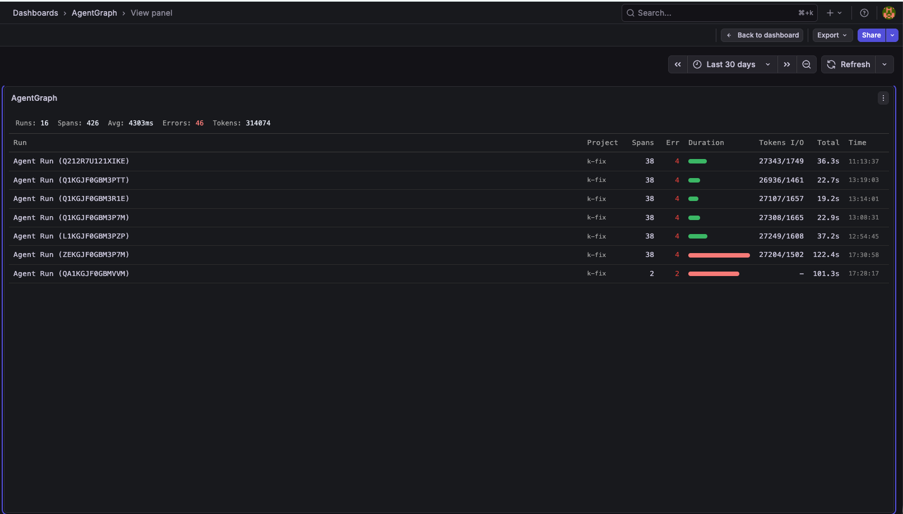
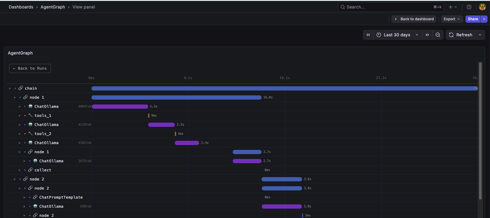

# AgentGraf — AI Agent tracing in Grafana

[](https://pypi.org/project/agentgraf/)
[](https://pypi.org/project/agentgraf/)
[](LICENSE)
[](tracer/tests/)

Zero-infrastructure tracing for AI agents (LangChain, LangGraph).
Uses your existing Grafana + Loki stack — no new database, no new UI.

**Requirements:** Python ≥ 3.10 · Loki ≥ 2.9 · Grafana ≥ 10.0

## Installation

```bash
# With LangChain / LangGraph support (recommended):
pip install agentgraf[langchain]

# Core API only (no LangChain dependency):
pip install agentgraf
```

## Screenshots

**RunsPanel** — list of agent runs with KPIs, duration bars, token counts, and error status:



**TraceTreePanel** — hierarchical span tree with per-span latency and token counts:



## Why AgentGraf?

| Tool | Setup | Grafana integration |
|------|-------|---------------------|
| LangSmith | SaaS (cloud) | ❌ Separate platform |
| LangFuse | Open source + PostgreSQL | ❌ Separate UI |
| AgentGraf | **Loki (already there)** | ✅ Native — in your dashboard |

You already have Grafana and Loki in your K8s cluster.
AgentGraf plugs right in — no extra database, no extra service.

## Quick start — LangChain / LangGraph

```python
from agentgraf import LokiClient, BatchSpanProcessor, AgentGrafTracer

# 1. Connect to Loki
client = LokiClient(loki_url="http://loki:3100/loki/api/v1/push")
processor = BatchSpanProcessor(exporter=client.send_spans_sync)
processor.start()

# 2. Attach the tracer to your agent
tracer = AgentGrafTracer(processor=processor, project="my-project")

# LangGraph
result = await graph.astream(state, config={"callbacks": [tracer]})
# LangChain
# result = chain.invoke(input, config={"callbacks": [tracer]})

processor.shutdown()
```

Then in Grafana Explore:
```logql
{job="agentgraf"} | json
```

Each log line is one span — you get `trace_id`, `span_id`, `latency_ms`, `input_tokens`,
`output_tokens`, `status`, and more, all queryable with LogQL.

## Manual span API

No LangChain? Use `TraceSpan` directly with `pip install agentgraf`:

```python
from agentgraf import LokiClient, BatchSpanProcessor, TraceSpan, SpanKind

client = LokiClient(loki_url="http://loki:3100/loki/api/v1/push")

with BatchSpanProcessor(exporter=client.send_spans_sync) as processor:
    span = TraceSpan(
        project="my-project",
        kind=SpanKind.LLM,
        name="gpt-4o",
    )
    span.set_input("What is the capital of France?")
    # ... call your model ...
    span.set_output("Paris")
    span.set_tokens(input_tokens=12, output_tokens=3)
    span.finish()
    processor.add_span(span)
```

### `TraceSpan` key fields

| Field | Type | Description |
|-------|------|-------------|
| `trace_id` | `str` | 32-hex UUID shared by all spans in one run |
| `span_id` | `str` | 16-hex UUID unique per span |
| `parent_span_id` | `str \| None` | Links to parent span (`None` = root) |
| `project` | `str` | Logical grouping label |
| `kind` | `SpanKind` | `llm`, `tool`, `chain`, `agent`, `retriever` |
| `name` | `str` | Operation name (model name, tool name…) |
| `latency_ms` | `int` | Computed by `finish()` |
| `input_tokens` | `int` | Prompt token count |
| `output_tokens` | `int` | Completion token count |
| `status` | `SpanStatus` | `ok` or `error` |
| `tags` | `dict` | Free-form labels |

## Architecture

```
Agent (Python)                  Loki                     Grafana
┌──────────────┐    POST       ┌─────┐    LogQL query   ┌──────────────┐
│ AgentGraf    │──────────────▶│     │◀─────────────────│ Panel Plugin │
│ Tracer       │  /loki/api/   │     │  data frames     │  Runs + Tree │
└──────────────┘   v1/push     └─────┘                  └──────────────┘
```

The Python tracer pushes spans directly to Loki — no extra gateway or sidecar.

## Grafana panel plugin

Two panels are included:

- **RunsPanel** — list of agent runs with duration bars, token counts, and status
- **TraceTreePanel** — hierarchical span tree (like Jaeger, but inside Grafana)

Install from the `grafana-plugin/` directory or via the Grafana plugin registry
(see [`grafana-plugin/README.md`](grafana-plugin/README.md)).

## Project structure

```
agentgraf/
├── tracer/            # Python package (PyPI)
├── grafana-plugin/    # Grafana panel plugin
└── examples/          # Usage examples
```

## Development

```bash
git clone https://github.com/Berg-it/agentgraf.git
pip install -e "tracer/[dev,langchain]"

# Run tests
PYTHONPATH=tracer/src pytest tracer/tests/ -v

# Lint & type-check
ruff check tracer/
mypy tracer/src/

# Manual test against a real Loki
LOKI_URL=http://localhost:3100/loki/api/v1/push python examples/send_test_spans.py
```

See [CONTRIBUTING.md](CONTRIBUTING.md) for guidelines.

## Changelog

See [CHANGELOG.md](CHANGELOG.md).

## License

MIT — see [LICENSE](LICENSE).
